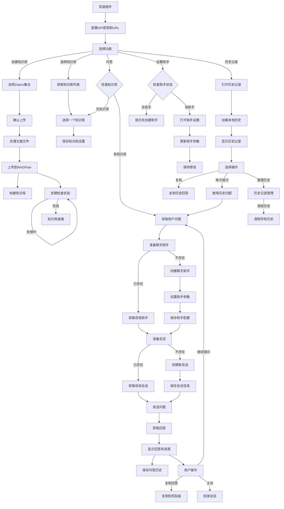

# Zotero-RAGFlow 插件

## 项目简介

Zotero-RAGFlow 是一款专为 Zotero 文献管理软件开发的智能知识库插件，它将 Zotero 的文献管理能力与 RAGFlow 的检索增强生成(Retrieval-Augmented Generation, RAG)技术相结合，让用户能够基于自己的学术文献进行智能问答交互。通过这个插件，研究人员和学者可以更有效地利用他们收集的学术资料，实现对文献内容的深度挖掘与利用。

## 核心功能

### 1. 文献知识库构建

- **文献上传**: 选择 Zotero 中的集合，一键将其中的文献附件（如PDF、文本文件等）上传到 RAGFlow 知识库
- **知识库管理**: 支持创建和选择不同的知识库，适应不同研究主题或项目需求
- **批量处理**: 自动处理集合中的多个文献，高效构建专业知识库

### 2. 基于文献的智能问答

- **智能分析**: 利用 RAG 技术，基于用户上传的文献内容进行准确的问题回答
- **来源引用**: 回答问题时展示信息来源，保证答案的可追溯性和可靠性
- **交互式问答**: 提供简洁直观的问答界面，支持连续提问和对话

### 3. 聊天助手定制化

- **参数调整**: 支持调整模型类型、温度、top_p等参数，优化问答效果
- **多模型支持**: 支持多种大语言模型，包括deepseek-chat、qwen-turbo、qwen-max等
- **助手更新**: 可随时更新聊天助手的配置参数，调整问答策略

### 4. 历史记录与管理

- **问答历史**: 自动保存历史问答记录，方便回顾和重用
- **会话管理**: 支持多会话管理，可为不同研究课题创建独立会话
- **复制与重用**: 一键复制回答内容，方便引用到研究笔记或论文中

## 技术特点

1. **无缝集成**: 完美融入Zotero界面，添加专用菜单与右键菜单，操作便捷
2. **检索增强生成**: 采用最新RAG技术，确保回答基于用户自有文献，提高准确性
3. **参数可调**: 提供丰富的参数设置界面，允许用户根据需求调整AI模型行为
4. **来源透明**: 所有回答均附带来源引用，确保信息可溯源
5. **安全可控**: 数据处理透明，用户掌握知识库内容的完全控制权
6. **完善的错误处理**: 针对各种情况提供友好的错误提示和恢复机制

## 使用流程

### 基础配置

1. 安装插件后，首先通过"工具"菜单或RAGFlow菜单进入设置界面
2. 配置RAGFlow API密钥和API URL
3. 保存设置后，插件就可以正常工作了

### 知识库构建

1. 在Zotero中选择一个包含研究文献的集合
2. 右键点击该集合，选择"发送到RAGFlow知识库"或使用顶部RAGFlow菜单
3. 确认上传，插件将自动处理文献并构建知识库
4. 等待知识库构建完成的通知

### 智能问答

1. 点击RAGFlow菜单中的"RAGFlow知识库问答"
2. 在问答界面输入您的学术问题
3. 系统会从您的文献中检索相关信息并生成回答
4. 查看回答及其来源信息，可以复制回答或继续提问

### 聊天助手设置

1. 通过RAGFlow菜单访问"聊天助手设置"
2. 调整各种参数以优化问答效果：
   - 选择语言模型
   - 设置温度参数（控制创造性）
   - 调整top_p值（影响词汇多样性）
   - 配置最大输出长度
   - 设置相似度阈值和检索结果数量
3. 保存设置，立即应用到问答交互中

## 配置选项详解

### API设置

- **API密钥**: 连接RAGFlow服务的身份验证令牌
- **API URL**: RAGFlow服务地址，本地部署默认为http://127.0.0.1:8000

### 聊天助手参数

- **模型**: 支持deepseek-resoner、deepseek-chat、qwen-turbo、qwen-max等模型选择
- **温度**: 0-1之间，控制回答的创造性与随机性
- **Top P**: 控制词汇选择的多样性
- **最大输出长度**: 限制回答的最大token数
- **相似度阈值**: 控制检索文档的相似度要求
- **检索结果数量**: 每次问答检索的文档片段数量

## 适用场景

- **学术研究**: 快速从大量文献中获取关键信息和研究见解
- **论文写作**: 基于已收集的文献进行文献综述和理论构建
- **学习辅助**: 帮助学生更好地理解和消化学术文献内容
- **知识管理**: 构建个人或团队的知识库，提升知识复用效率
- **跨学科探索**: 在不同学科领域的文献中发现关联和创新点

## 技术架构

Zotero-RAGFlow插件采用模块化设计，主要包含以下组件:

1. **RAGFlowService**: 负责与RAGFlow API通信，处理知识库创建、文档上传和问答核心功能
2. **RAGFlowUI**: 提供所有用户界面元素，包括菜单、对话框和交互组件
3. **Addon**: 插件主类，协调各模块工作并管理插件生命周期
4. **Logger**: 提供统一的日志记录功能，支持调试和故障排查
5. **StorageManager**: 负责处理聊天历史等数据的持久化存储

通过这种模块化设计，插件实现了功能与界面的分离，提高了代码的可维护性和扩展性。

## 系统流程图

下面的流程图展示了Zotero-RAGFlow插件的主要工作流程：

## 数据流向

1. **文献上传**: Zotero集合 → 文件处理 → RAGFlow API → 知识库
2. **知识库查询**: 用户问题 → RAGFlow API → 文档检索 → LLM处理 → 生成回答
3. **历史管理**: 问答记录 → 本地存储 → 历史记录UI

## 错误处理机制

1. **API错误**: 提供友好错误提示，指导用户解决连接问题
2. **余额不足**: 检测API账户余额不足情况，提供明确提示
3. **文件类型不支持**: 过滤不支持的文件类型，避免上传失败
4. **知识库状态监控**: 定期检查知识库构建状态，及时反馈进度

---

Zotero-RAGFlow插件通过将Zotero的文献管理能力与先进的RAG技术相结合，为学术研究和知识管理提供了强大的助力工具。它不仅让用户能够更高效地利用已有文献资源，还通过智能问答功能拓展了文献利用的深度和广度，是现代学术研究的理想辅助工具。