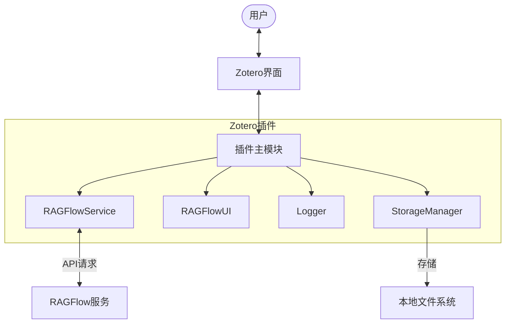
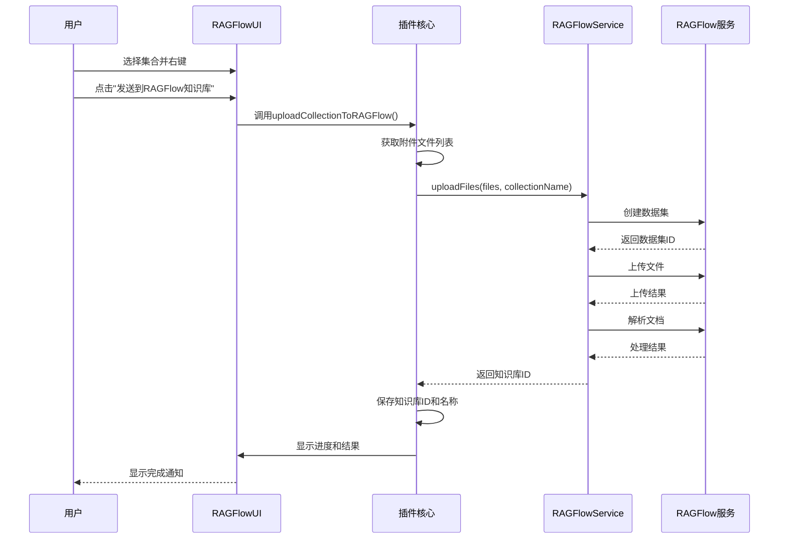
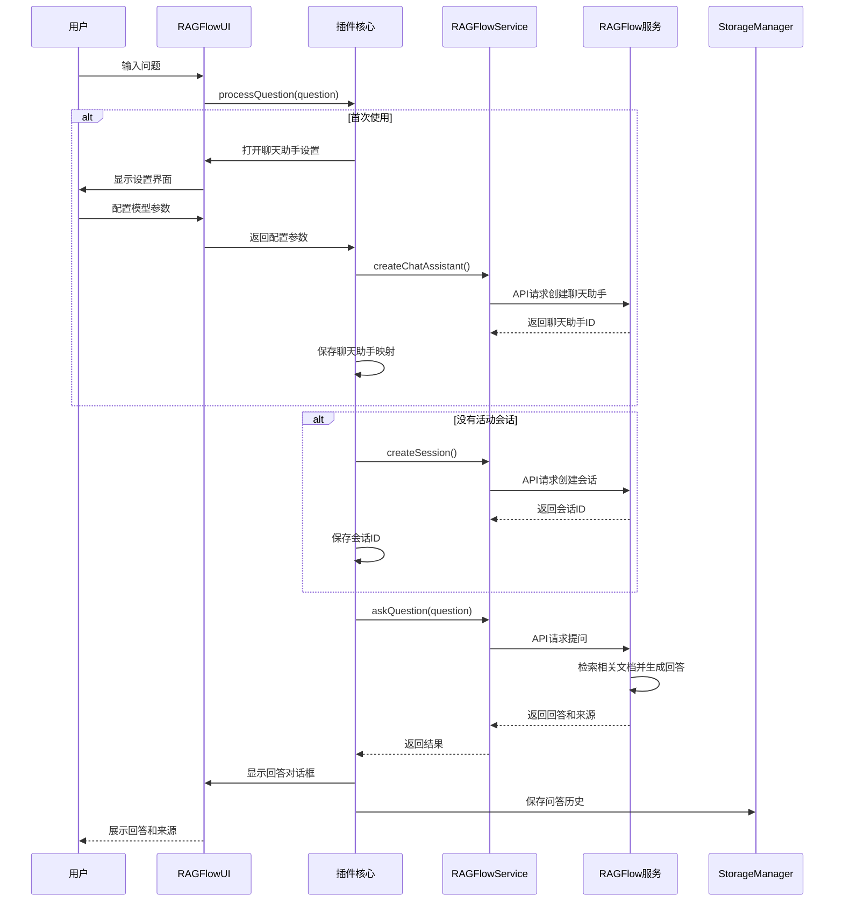
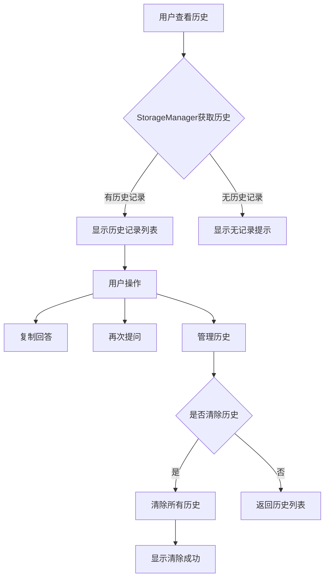

# Zotero-RAGFlow 插件

Zotero-RAGFlow是一款将RAG（检索增强生成）技术集成到Zotero中的插件，让研究人员和学者能够基于自己的文献资料构建知识库并进行智能问答。通过该插件，用户可以直接将Zotero条目中的附件文档上传到RAGFlow服务，构建个性化知识库，并利用大语言模型对自己的文献进行提问和分析。

## 功能特点

- **知识库构建**：将Zotero集合中的附件文件上传到RAGFlow服务，自动构建知识库
- **智能问答**：基于自己的文献资料进行提问，获取精准回答
- **参考来源追踪**：回答内容附带原始文档参考来源，确保可溯源性
- **多种模型支持**：提供多种大语言模型选择，如deepseek-chat、qwen-turbo等
- **参数自定义**：可配置温度、相似度阈值等关键参数
- **历史记录管理**：保存问答历史，支持重复提问和回答复制
- **本地部署支持**：支持连接本地部署的RAGFlow服务

## 安装说明

1. 下载最新版本的`zotero-ragflow.xpi`插件文件
2. 在Zotero中打开"工具" > "附加组件"
3. 点击齿轮图标，选择"从文件安装附加组件"
4. 选择下载的`zotero-ragflow.xpi`文件
5. 重启Zotero完成安装

## 配置设置

首次使用前，需完成以下配置：

1. 点击"工具" > "RAGFlow设置"或顶部菜单栏"RAGFlow" > "设置"
2. 输入RAGFlow API密钥
3. 设置RAGFlow API URL
   - 本地部署默认为`http://127.0.0.1:8000`
   - 云服务使用提供商指定的URL

## 使用指南

### 创建知识库

1. 在Zotero中选择一个包含文献的集合
2. 右键单击该集合，选择"发送到RAGFlow知识库"
3. 在弹出的确认对话框中点击"确定"
4. 系统将自动上传集合中的附件文件并构建知识库
   - 支持PDF、Word文档、文本文件等格式
   - 不支持HTML快照文件

### 选择知识库

1. 点击顶部菜单"RAGFlow" > "选择已有知识库"
2. 从列表中选择要使用的知识库

### 配置聊天助手

1. 点击"RAGFlow" > "聊天助手设置"
2. 选择模型（如deepseek-chat、qwen-turbo等）
3. 调整参数：
   - 温度：控制回答的创造性（0-1）
   - 相似度阈值：控制文档检索的相关性要求
   - 检索结果数量：影响参考来源数量

### 知识库问答

1. 点击"RAGFlow" > "RAGFlow知识库问答"
2. 在对话框中输入您的问题
3. 点击"提问"按钮
4. 系统会显示回答结果及其参考来源

### 查看历史记录

1. 点击"RAGFlow" > "查看问答历史"
2. 浏览之前的问答记录
3. 可以复制回答或再次提问相同问题

## 系统架构图

### 整体架构

### 知识库创建流程

### 知识库问答流程

### 历史记录管理流程

## 技术细节

### 支持的文件类型

- PDF文档 (.pdf)
- Word文档 (.doc, .docx)
- 文本文件 (.txt)
- 其他RAGFlow支持的文件类型

**注意:** 当前不支持HTML快照文件

### 模型选项

可用的大语言模型:

- deepseek-resoner
- deepseek-chat
- qwen-turbo
- qwen-max
- qwen-plus
- qwen-long

### 存储管理

- 聊天历史保存在Zotero数据目录的`ragflow-history`文件夹中
- 知识库ID、聊天助手ID和会话ID保存在Zotero首选项中

## 常见问题

1. **问: 为什么我的HTML快照无法上传?**  
   答: 当前版本不支持HTML快照文件，请使用PDF或文本文件。

2. **问: 如何切换不同的知识库?**  
   答: 点击"RAGFlow" > "选择已有知识库"，从列表中选择。

3. **问: 如何优化问答质量?**  
   答: 调整聊天助手设置中的参数，特别是相似度阈值和温度值。

4. **问: API余额不足怎么办?**  
   答: 登录RAGFlow平台充值或联系服务提供商。

## 注意事项

- 知识库构建需要时间，取决于文档数量和大小
- 大型文档集合可能需要较高的处理资源
- 请确保有足够的API余额用于处理请求
- 处理敏感数据时请考虑数据隐私和安全性

## 许可信息

此插件基于[MIT许可证](LICENSE)发布。

---

_Zotero-RAGFlow: 让文献知识流动起来_
